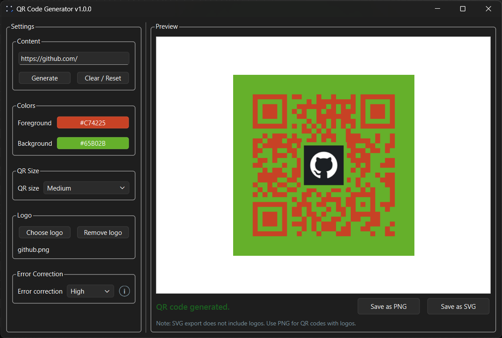

# QR Code Generator

A simple PySide6 desktop application for generating QR codes from text or URLs.

Version: `1.0.0`

## Preview



## Features

- Enter text or a URL.
- Generate a live QR preview inside the app.
- Choose foreground and background colors.
- Select QR size: Small, Medium, or Large.
- Select error correction: Low, Medium, Quartile, or High.
- Add an optional center logo image.
- Remove the selected logo.
- Clear and reset the form.
- Save the generated QR code as PNG.
- Save the generated QR code as SVG.
- Shows a validation error when the input is empty.

## SVG Logo Note

PNG export includes the embedded logo when one is selected.

SVG export is intentionally logo-free in v2. The SVG output keeps the selected QR colors and size, but it does not embed the selected logo image. This keeps SVG export simple, portable, and easy to inspect.

## Setup

Create and activate a virtual environment:

```powershell
python -m venv .venv
.\.venv\Scripts\Activate.ps1
```

Install dependencies:

```powershell
pip install -r requirements.txt
```

## Run

```powershell
python main.py
```

## Build

Install the dependencies first, then build the Windows executable with the included build script:

```powershell
python build.py
```

The script runs PyInstaller with the app name `QRCodeGenerator`. The executable is created under `dist/`.

If `assets/app.ico` exists, the build script uses it as the Windows executable icon. The application window also loads `assets/app.ico` at runtime when the file is present.

The source icon is available at `assets/app.svg`. Convert it to `assets/app.ico` when you want the app window, executable, and installer to use the icon.

Equivalent manual command:

```powershell
pyinstaller --onefile --windowed --name QRCodeGenerator main.py
```

## Installer

Build a Windows installer with Inno Setup:

1. Run `python build.py`.
2. Open `installer/QRCodeGenerator.iss` with Inno Setup.
3. Click `Build > Compile`.
4. Find `QRCodeGeneratorSetup.exe` in `installer/Output`.

## Notes

The app does not overwrite `qrcode.svg` automatically. QR files are written only when you choose a save location from the Save buttons.
